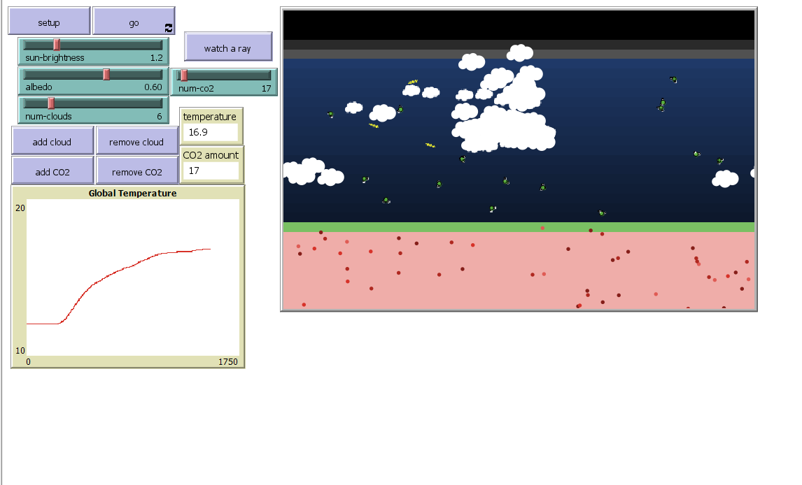
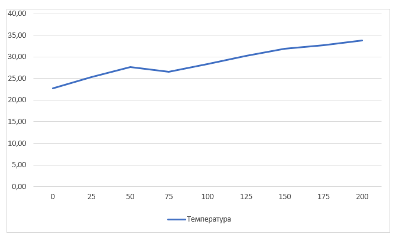

## Комп'ютерні системи імітаційного моделювання
## СПм-22-5, Штепа Дем'ян
### Лабораторна робота №**2**. Редагування імітаційних моделей у середовищі NetLogo

 

### Варіант 2, модель у середовищі NetLogo:
[Climate Change](http://www.netlogoweb.org/launch#http://www.netlogoweb.org/assets/modelslib/Sample%20Models/Earth%20Science/Climate%20Change.nlogo)

 

### Внесені зміни у вихідну логіку моделі, за варіантом:

**Додати можливість вказівки початкової кількості хмар.** 

Додано слайдер для вказівки початкової кількості хмар:

Змінено процедуру *setup*. Тепер вона через цикл *repeat* створює потрібну кількість хмар в залежності від значення слайдера (максимум 30 хмар):
<pre>
  repeat num-clouds [add-cloud]
</pre>

**Додати зміну кута падіння нових сонячних промінів протягом часу**

Додано глобальну змінну *day-length* довжина дня. Її значення - 900 (тіків). Змінено процедуру to create-sunshine. Тепер угол падіння променів вимірюється від 110 до 260 градусів в залежності від кількості тіків з початку симуляції.

<pre>
  to create-sunshine
  ;; don't necessarily create a ray each tick
  ;; as brightness gets higher make more
  if 10 * sun-brightness > random 50 [
    create-rays 1 [
      let angle 110 + (ticks mod day-length / 6)
      set heading angle
      set color yellow
      ;; rays only come from a small area
      ;; near the top of the world
      setxy (random 10) + min-pxcor max-pycor
    ]
  ]
end
</pre>

### Внесені зміни у вихідну логіку моделі, на власний розсуд:

**Додати можливість вказівки початкової кількості CO2.**

Додано слайдер для вказівки початкової кількості CO2:

Змінено процедуру add-CO2. А саме, тепер вона приймає число, яке означає скільки треба створити молекул:
<pre>
  to add-CO2 [num]  ;; randomly adds 25 CO2 molecules to atmosphere
  let sky-height sky-top - earth-top
  create-CO2s num [
    set color green
    ;; pick a random position in the sky area
    setxy random-xcor
          earth-top + random-float sky-height
  ]
end
</pre>

Додано виклик процедури add-CO2 в процедуры setup:

<pre> add-CO2 num-co2 </pre>

Також змінено роботу кнопки "add CO2":

**Додати зміну дня та ночі.**

Раз в 900 тіків буде змінюватись день на ніч і навпаки. Колір неба буде змінюватись на чорний, а сонце не буде випромінювати світло вночі. Все інше без змін.

Додано глобальну змінну, яка означає зараз день чи ніч:

<pre> day? </pre>

Створено процедуру, яка мінює колір неба на чорний(насправді, дуже темний відтінок синього) або синій:

<pre> 
to update-sky
  ifelse day?[
    ask patches [ 
      if pycor <= sky-top and pycor > earth-top [set pcolor scale-color blue pycor -20 20]
    ]
  ]
  [
    ask patches [ 
      if pycor <= sky-top and pycor > earth-top [set pcolor scale-color blue pycor -10 80]
    ]
  ]
end
</pre>

Змінено процедуру *go*. Тепер на початку визначається день зараз чи ніч, і в залежності від цього змінюється змінна day? та встановлюється відповідний колір неба:

<pre>
  to go
  if (ticks + 1) mod 900 = 0 [
    set day? not day?
    update-sky
  ]
  ...
  end
</pre>

Змінено процедуру *run-sunshine*. Тепер промені створюються лише вдень:
<pre>
  to run-sunshine
  ...
   if day? [create-sunshine]  
  ...
  end
</pre>

Фінальний код моделі та її інтерфейс доступні за 
[посиланням](Climate_Change-ext.nlogo)

 

## Обчислювальні експерименти 
### 1. Вплив кількості CO2 в атмосфері на температуру Землі.
Досліджується вплив кількості CO2 в атмосфері на температуру Землі. Береться значення температури, якого може досягти Земля за певний період часу (10 000 тіків).
Експерименти проводяться при 0-200  значеннях CO2 в атмосфері, з кроком 25, усього 9 симуляцій.  
Інші керуючі параметри мають значення за замовчуванням:
- **sun-brightness**: 1.0
- **albedo**: 0.6
- **num-clouds**: 0

<table>
<thead>
<tr><th>кількості CO2</th><th>Температура</th></tr>
</thead>
<tbody>
<tr><td>0</td><td>22,7</td></tr>
<tr><td>25</td><td>25,3</td></tr>
<tr><td>50</td><td>27,6</td></tr>
<tr><td>75</td><td>26,5</td></tr>
<tr><td>100</td><td>28,3</td></tr>
<tr><td>125</td><td>30,2</td></tr>
<tr><td>150</td><td>31,9</td></tr>
<tr><td>175</td><td>32,7</td></tr>
<tr><td>200</td><td>33,8</td></tr>
</tbody>
</table>

Графік наочно показує, що зростання кількості CO2 в атмосфері призводить до збільшення температури. Майже як і минулого такого ж експеременту. Але в цей раз температура приблизно на 2 градуси менша при відповідному значенні CO2. Певно, на це впливає зміна дня і ночі, адже вночі нові промені не з'являються і у планети є шанс охолонути.

